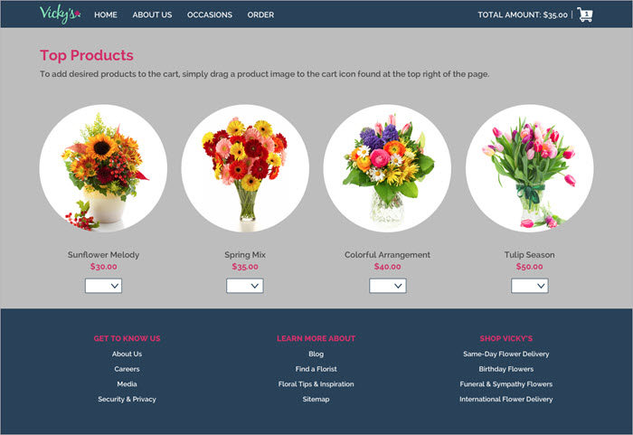

# Vick's Flowers

This is a single-page website administered by [Stamps.com](Stamps.com) as part of a take-home test. It has some of the following features:

- Mobile-ready, fully-responsive design
- Accessibility tested and ARIA-compliant for use with screen readers and other assitive technology
- Use of [Parcel.js](Parcel.js) for a simplified build environment



## Installation

Use npm or yarn to install dependencies.

```sh
yarn

# or

npm install
```

## Usage

Development mode:

- Starts a dev server
- Bundles but does not optimize or minify
- Launches website at [http://localhost:1234/](http://localhost:1234/)

```sh
yarn dev

# or

npm run dev
```

Production mode:

- Will only build once (No watch mode or hot module replacement)
- Minifies html, js, css, and optimizes image resources
- Output to `/dist`

```sh
yarn build

# or

npm run build
```

## Additional Info

Instructions for the assignment can be found at

- [docs/INSTRUCTIONS.md](docs/INSTRUCTIONS.md)
