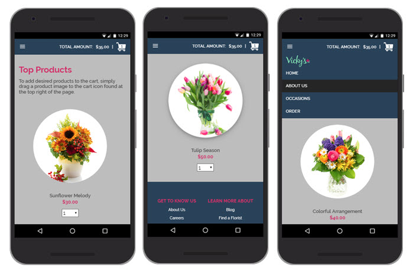
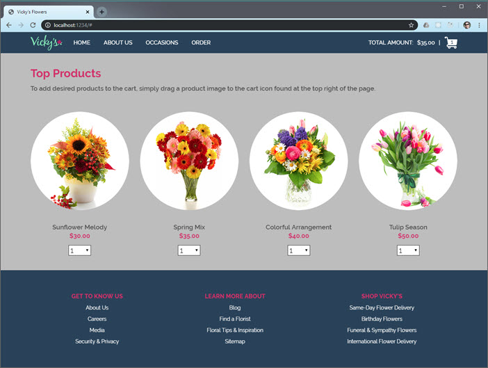

# Vicky's Flowers

This is a single page web app showing a ficticous e-commerce site. It was built from the comp shown below and administered by [Stamps.com](Stamps.com) as part of a take-home test.


The completed project has the following features:

- Mobile-ready, fully-responsive design.
- Accessibility tested and ARIA-compliant for use with screen readers and other assistive technology.
- Use of [Parcel.js](Parcel.js) for simplified build environment, image compression, minification, & bundling.

Assignment instructions can be found here:

- [docs/INSTRUCTIONS.md](docs/INSTRUCTIONS.md)

## Installation

Clone the repository.

```bs
git clone https://github.com/james-priest/vickys-flowers.git
cd vickys-flowers
```

Use yarn or npm to install dependencies.

```sh
yarn

# or

npm install
```

## Usage

### Development mode

- Starts a dev server.
- Bundles but does not optimize or minify.
- Launches website at [http://localhost:1234/](http://localhost:1234/).

```sh
yarn dev

# or

npm run dev
```

### Production mode

- Will build once (No watch mode or hot module replacement).
- Minifies html, js, css, and optimizes image resources.
- Outputs to `dist/`.

```sh
yarn build

# or

npm run build
```

In order to view the production version a local http server should be used to launch `dist/index.html` .

Here are a couple links showing how to do this.

- [Simple HTTP Server](http://jasonwatmore.com/post/2016/06/22/nodejs-setup-simple-http-server-local-web-server) - Runs on Node.js.
- [How to run things locally](https://threejs.org/docs/#manual/en/introduction/How-to-run-things-locally) - Instructions for Node.js, Python, & Ruby.

Alternatively, a Visual Studio Code extension can be used to run the site from within the VSCode dev environment.

- [Live Server](https://marketplace.visualstudio.com/items?itemName=ritwickdey.LiveServer) - Launch a development local Server with live reload feature for static & dynamic pages.

## Additional Info

Instructions for the assignment can be found at

- [docs/INSTRUCTIONS.md](docs/INSTRUCTIONS.md)

## Screenshots




